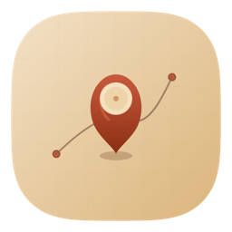

<p align="center">
  
</p>

<h1 align="center">Twine</h1>

<p align="center"><em>Your travels, on a map. Seeded from your photos. Yours alone.</em></p>

<p align="center">
  A native macOS keepsake: a poster-style world map where every place you have been
  gets a pin, connected by thread back to Home, with your photos and dates behind it.
  Populates itself from your photo library in seconds. No typing required.
</p>

<p align="center">
  
  
  
  
</p>

---

<!-- TODO: capture real screenshots of the running app and place them in assets/ -->
<p align="center">
  
</p>

## Why

You have thousands of geotagged photos spread across years and continents. Twine reads the GPS and date from each one (on-device, never uploading anything) and builds a cumulative life-map in seconds. Ten years of travels, reconstructed without typing a single place name.

The result is a keepsake artifact you would hang on a wall: a clean poster-style map, pins for every city you have visited, thin thread running from each pin back to a Home marker. Click any pin to see the photos, dates, and notes behind it.

It is not a trip planner, a bucket list, or a social feed. It is a memory wall.

## What it looks like

<!-- TODO: capture real screenshots of the running app and place them in assets/ -->

<p align="center">
  
</p>

The board has three panes:

- **Left sidebar:** a searchable, sortable list of every place.
- **Center map:** the poster canvas with pins, thread, and framed photo thumbnails.
- **Summary panel:** countries, cities, continents, total thread distance, first and last trip.

Click a pin to open the detail view: a photo strip, the date range, visit count, and an editable title and note.

<p align="center">
  
</p>

## Private by design

- **100% local. No network, ever.** There is intentionally no network entitlement in the sandbox.
- **Read-only Photos access.** Twine reads GPS coordinates and dates from your photo metadata. It never copies your photos or uploads anything.
- **No account, no cloud, no sync.** Everything lives in SwiftData on your Mac.
- Geocoding is done offline against a bundled city database. No `CLGeocoder`, no API calls, no rate limits.

## Install

**Build from source** (Xcode 26, macOS 14+):

```bash
brew install xcodegen
git clone https://github.com/IvanKuria/Twine.git
cd Twine
xcodegen generate
open Twine.xcodeproj      # then press Cmd-R
```

A notarized DMG is coming on the [Releases page](https://github.com/IvanKuria/Twine/releases).

## How it works

A clean two-layer split:

- **`TwineKit`** is a pure, unit-tested Swift package with no UI, no PhotoKit, no AppKit imports. It owns all deterministic logic: the data model (`PhotoSample`, `Place`, `Pin`, `Trip`), spatial clustering (groups nearby photos into one place so 50k photos don't produce 50k overlapping pins), offline reverse-geocoding against a bundled GeoNames SQLite database, stats (countries, cities, continents, haversine distance, total thread miles), dedup and date-range merging for repeat visits, and equirectangular projection math. **18 tests.**
- **`Twine`** is a thin SwiftUI and AppKit app. It handles PhotoKit authorization and background metadata scanning (reading `asset.location` and `asset.creationDate` directly, never fetching image data during the scan), drives the custom SwiftUI `Canvas` poster map (country shapes from bundled Natural Earth polygons, pins, thread overlay, pan/zoom, hit-testing), lazy thumbnail loading via `PHCachingImageManager`, pin detail, the sidebar and summary panels, SwiftData persistence, settings, and image export.

The map is rendered on a SwiftUI `Canvas` -- not MapKit -- so the poster aesthetic and `ImageRenderer`-based image export both work without compromise.

## Export

Twine can render the board to a high-resolution image file.

## Contributing

Contributions are welcome. See [CONTRIBUTING.md](CONTRIBUTING.md).

The contribution registry is the easiest place to start. These are self-contained, low-scope PRs that make a real difference:

- **Map themes and poster styles** -- color ramps, paper textures, ocean fills.
- **Pin and thread styles** -- shape, weight, shadow, color palettes.
- **Importers** -- GPX files, Google Takeout location history, Swarm/Foursquare exports. Each importer is a self-contained module that produces `PhotoSample`-compatible data and plugs into the existing pipeline.
- **Localization.**

## Credits and data

- **GeoNames `cities5000`** -- offline reverse-geocoding database. (c) GeoNames, [CC BY 4.0](https://creativecommons.org/licenses/by/4.0/). Attribution is shown in the app's About/Credits screen.
- **Natural Earth 1:110m** country polygons -- public domain. Used for the poster map country shapes.

## License

[MIT](LICENSE) (c) 2026 Ivan Kuria
